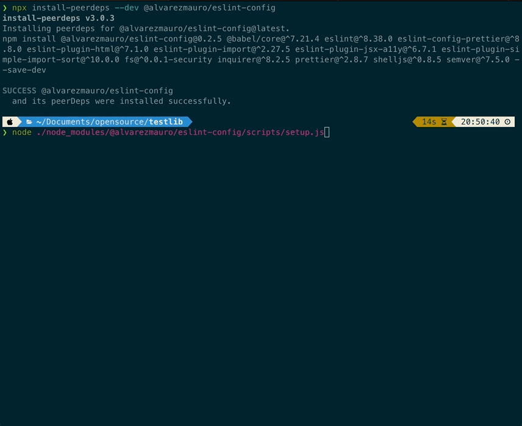

# @alvarezmauro/eslint-config
This package will help you set up Prettier, ESLint, and TypeScript based on the project you choose from a list (JS, JS+TS, React, React+TS).
It also helps you to install the necessary dependencies and configure your project and VScode workspace.

**Note:** The Prettier and ESLint configuration is **very opinionated**. I use Airbnb's linting rules as a base and I add my own rules on top of it. 

## Prerequisites ##
- Node.js (^v18.15.0 recommended)

## Installation ##
Install package and peerdependencies
```
npx install-peerdeps --dev @alvarezmauro/eslint-config
```
Execute setup script
```
node ./node_modules/@alvarezmauro/eslint-config/scripts/setup.js
```

## Usage ##
Once you execute the `setup` command you just need to follow the prompt.


## Features ##
- Installs required dependencies for ESLint, Prettier, and TypeScript
- Adds a "lint" command to your package.json
- Adds recommended VSCode plugins to your workspace settings
- Adds recommended VSCode settings for ESLint and Prettier to your workspace
- Handles existing configuration files by prompting the user to choose between creating a new file, overriding the existing file, or merging the recommended configuration with the existing one.

## Contributing ##
If you encounter any issues, feel free to [open a new issue](https://github.com/alvarezmauro/eslint-config/issues). [Pull requests](https://github.com/alvarezmauro/eslint-config/pulls) are also welcome.

## License ##
This project is licensed under the [MIT License](LICENSE).

